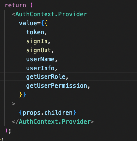
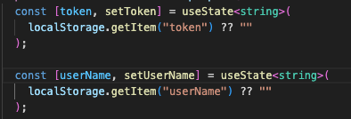
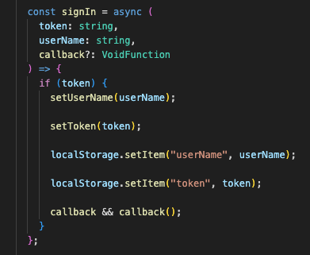
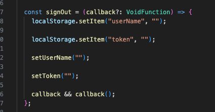

## 缓存&优化性能：

## useMemo

这里是用在缓存计算结果的值，只有当依赖项发生变化时，才会重新计算渲染；如果不使用的话，每次调用接口，都会计算一次结果，重复渲染，除了可以缓存的话，还能起到一个优化性能的作用。

例如：

这里用 useMemo 来缓存获取接口参数返回的计算结果（如 flatMap、map 的计算），当接口正常获取 rolePermissionData 时，开始正常计算流程通过 flapMap 展开且不为空时，再使用 map 的方式把获取到的当前用户的所有 role 来渲染出来，那么只有依赖的 rolePermissionData 发生变化时，才会去重复上列的计算来获取结果。

 s(.png>)

适合使用的场景：需要计算缓存结果而不是函数引用，因此使用 useMemo 是最合适的选择。如果是缓存函数的引用的话，需要用到 useCallback

## useCallback

用于缓存函数的引用，把 useMemo 改成用 useCallback，上面 getUserRole 返回的是函数，不是值，会导致是无法直接使用其计算的结果，需要去调用函数。

## useMemo & useCallback：

都是用来缓存，前者是缓存计算结果，返回计算后的值；后者是缓存函数引用，会返回新函数。

## useContext

用于访问上下文的值，可以避免深层组件通过 props 逐层来传递数据的场景。

例如：

1、在外层 auth- Provider 通过创建 createContext

;.png>)

2、再通过提供 Context 值使用 Context.Provider 来为子组件提供上下文的数据：

3、 再把 AuthContext 放在 useContext 的意思是子组件可以通过 useAuth 直接调用到 context 中的值；可以子组件里需要用带 context 的值时，重复写 useContext（AuthContext）

## 整理 auth-provider.tsx、auth-Status.ts、use-auth.tsx 笔记：

## auth-provider.tsx

这一层是在外层定义登入登出的方法、或者一些登陆后需要获取的权限接口等

## auth-Status.ts

这层是为了通过权限来判断路由的跳转，用来包住 Route 的 element 进行符合判断条件后的跳转，这里的判断跳转只能用 location.pathname 来实现目标路径的跳转，如果使用 naviage 来实现跳转会导致路由循环跳转，反复渲染的情况，naviage 是用在指定跳转的页面。

## use-auth.tsx

这里是 provider 层的 AuthContext 通过使用 useContext 来传，在子组件里可以直接去调用定义的 useAuth 来使用 provider 层定义的 context 值。

## auth-provider （signIn、signOut）

1、需要先通过使用 useState 来存储 token、userName，如下：

初始值如果能从本地存储中获取到 token 就存到初始值（登陆后，当 token 存在时不会跳出到 login），除非 token 为空，可以避免一刷新页面就会清空 token 返回到 login 的情况；

2、signIn 的登入方法：

这里的意思是先定义了登入需要的类型：
如 token、userName、callback 是登陆成功后需要立即执行某些特定的后续操作（指登陆后需要立刻执行去到那个页面、刷新页面、关闭登陆窗口等场景）

接着判断 token 是否存在：
如果有 token，就把 userName、token 存到用 useState 定义的 setUserName、setToken 里面；
如果有 token，还需要把 userName、token 通过使用 localStorage.setItem 到本地存储；
 在最后通过使用 callback 的函数来执行保存；

3、signOut 登出的方法：

这里的意思是：
通过使用(callback?: VoidFunction)函数来处理执行后的后续操作 signOut 执行之后，需要把 userName、token 存回个空的给 localStorage.setItem 里面（把 token、userName 清空）
同时也需要把 useState 存储的 setToken、setUserName 清空，最后就是调用 callback 来回调函数，清理后执行。
