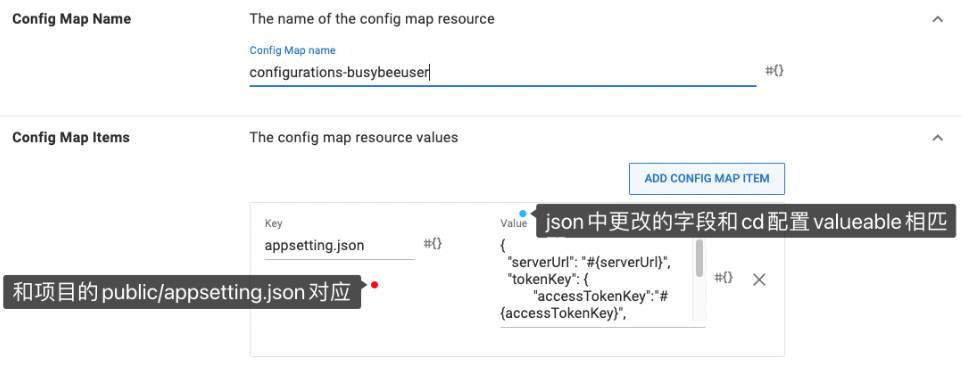
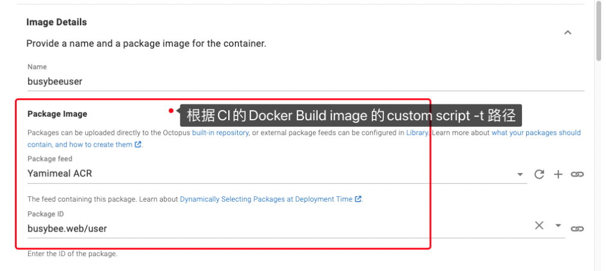

項目配置 CD 流程：

（基本 Process 分為兩步：:Deploy web 和 Deploy.ingess）

在每個步驟裡要注意跟項目的命名、項目中的更改的字段對應等問题，而且要注意跟 CI 的 build 的位置關聯，還有 service port 那裡要對應 dockerfile 的 espose 等;

Create Release - Process - Deloy Typel(set name、On Behalf of -這裡項目發布的集群、根據項目需求選擇)

1、首先是 Deploy web 的配置：

（1）

(2)Variables 對應：

（3）Container：

（4）Container 裡 Volume Mounts 对应 docker 内 build 包的 json 内的字段進行替換：

（5）service ports：

2、Deploy ingress：k8s 部署入口：

（1）

（2）Variables：

