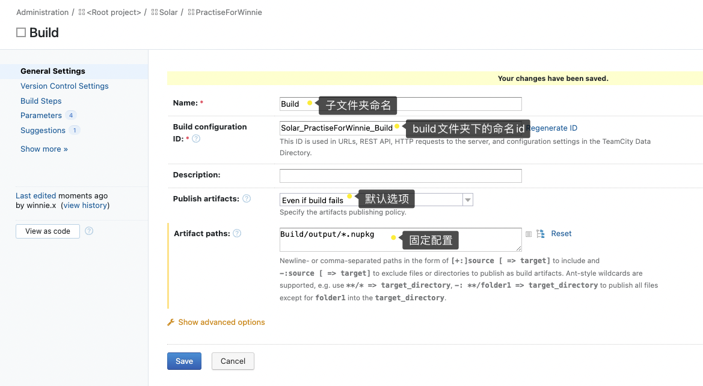

项目配置CI流程：

Step1: build-genreal settings

1、Name:ZZZ （为子文件夹的命名）
2、Build configuration ID：XX_Abc_ZZZ  (为build文件夹下name的命名ID)
3、Publish artifacts:Even if build fails (为默认选项，用于设置推送build产物到服务器的条件)
4、Artifact paths:Build/output/*.nupkg (固定配置，用于设置build产出的路径)

Step2:Edit- VCSeeting Root：


1、Type of VCS: 选择Git；
2、root Name：Abc（项目的名稱），
3、VCS root ID：XX_Abc_Abc（項目的ID）
4、fetch url：https：//…… (該項目關聯的路徑)
5、default branch：../../master（為項目默認的分支）

Step3:Build Steps：

Add build step 7part：

1、Docker login：

（runner type：Docker、step name：Docker login（此步驟的名稱）、Docker command：select：other、command name：login）



2、Docker Build Image：

Docker Build Image与Docker Push Image的区别在于 Custom script的参数不一样，如：

（1）Docker Build Image第一行参数为:
repository=`echo %build.number%|sed ’s/+/-/g’`
（獲取TeamCity的構建編號：%build.number%  然後通過sed命令將他的+替換成-，因為docker的鏡像tag不可包含符號+，所以要替換成符號-）

（2）Docker Build Image第二行参数为:
docker build -f Dockerfile -t %docker.registry%/solar/practise4travis:$repository .



3、Docker Push Image

4、Docker Remove

5、GitVersion

6、Install Dependencies

7、Build：[choose：Command Line]