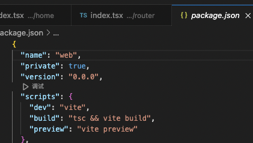

项目搭建：

vite+react+taildwind+ts

Step1:

1、创建项目（创建最新版本的 vite- create）[命令 1 和命令 2 同时执行的话，会导致项目中多包涵了个项目]

命令 1: npm create vite@latest react-ts -- --template react-ts

或

由于新版本无法使用 yarn，需创建 2.8.0 的 vite（命令 2 的话需要自己设定 project name、react、react-ts 等）

命令 2:npm init vite@2.8.0

3、項目名稱等 Setting：
project name：XXX
package name：xx_xxx_xxx
Select a framework:react(选择框架，如 react)
select a variant：react or react-ts

 xiaoxiaomancNac-Studio-6 ~ npm init vitea2.8.0.jpg>)

Step2:打開並初始化項目

1、在 vs code 裡打開創建的項目

2、刪除 App.css 和 logo.svg，並且把 App.tsx 改為 app.tsx

3、在 package.json 中修改”name”：“web”，如：


4、修改 index.html 裡的網站標題<title>XXX</title>(XXX 為本次項目的名稱)



5、安装路由：yarn add react-router-dom

6、創建 Router 文件



7、創建 pages/home 文件



8、把文件 app.tsx 裡多餘代碼刪掉，並改成：



9、配置路徑別名：

（1）安裝@type/node：yarn add @types/node -D

（2）在 tsconfig.json 文件中的 "compilerOptions”裡加入
"baseUrl": "./",
"paths": {
"@/_": ["src/_"]
}



（3）在 vite.config.ts 中配置為：
import path from "path";
export default defineConfig({
alias: {
"@": path.resolve(\_\_dirname, "./src"),
},
});



（4）tailwind css 的安裝：yarn add -D tailwindcss postcss autoprefixer

（5） tailwind.config.js 和 jspostcss.config.js 的生成：npx tailwindcss init -p

（6）生成後，在 tailwind.config.js 中給 content 加入："./index.html", "./src/\*_/_.{js,ts,jsx,tsx}"



（7）在根目录的 index.css 文件中添加以下，並試用 tailwind css；

@tailwind base;
@tailwind components;
@tailwind utilities;



（8）安裝 ahooks、ramda、axios

yarn add ahooks
yarn add ramda
yarn add axios
