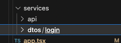

login 接口对接：

Step1:在 public 层建一个 appsetting.json 文件，配置全局：

{
"serverUrl": "https://testapi.yamimeal.com",
"jsVersion": "3.8.0",
"sourceSystem": "web_customer",
"languagecode": "zh-TW"
}

Step2:在 src 层新建一个 appsettings.ts 文件，定义类型：

export interface AppSettings {
serverUrl: string;
jsVersion: string;
sourceSystem: string;
languagecode: string;
}

const settings = (window as any).appSettings;

export async function InitialAppSetting() {
if ((window as any).appSettings) return (window as any).appSettings;

await fetch("../appsetting.json", {
headers: { "Content-Type": "application/json", Accept: "application/json" },
})
.then((res) => res.json())
.then((res: AppSettings) => {
return ((window as any).appSettings = res);
});
}

export default settings as AppSettings;

Step3:在 src 新建 AppHook.ts，用来初始化 appsetting：

import { useState, useEffect } from "react";
import { InitialAppSetting } from "./appsettings";

const useAction = () => {
const [isLoaded, setIsLoaded] = useState<boolean>(false);

useEffect(() => {
InitialAppSetting().then(() => setIsLoaded(true));
}, []);
return { isLoaded };
};

export default useAction;

Step4:放在 app.tsx 中使用：



Step5:在 services 文件夹里建一个 api 和 dtos 的文件夹



Step6:在 api 文件中配置一个 http-client.tsx，配置：

import { message } from "antd";
import axios from "axios";

export const api = axios.create({ baseURL: "" });

api.interceptors.request.use(
(config) => {
const appSettings = (window as any).appSettings;

    config.baseURL = appSettings.serverUrl;

    const authorizeToken = localStorage.getItem(appSettings.tokenKey);

    authorizeToken &&
      (config.headers.Authorization = `Bearer ${authorizeToken}`);

    return config;

},
(error) => {
return Promise.reject(error);
}
);

api.interceptors.response.use(
(response) => {
if (response.data.code === 200) {
return response.data;
}

    return Promise.reject(response.data);

},
(error) => {
if (error.response.status === 401) {
localStorage.removeItem((window as any).appSettings?.tokenKey);
message.error(
error.response.data.msg ?? "登录已过期，请重新登录",
1,
() => {
window.location.href = "";
}
);
} else {
return Promise.reject(error.response.data.msg ?? "Unknown error");
}
}
);

Step7:在 api 中建一个 login 的文件夹放 index.ts:

import { IPostLoginType } from "@/services/dtos/login";
import { api } from "../http-client";

export const PostLogin = async (data: IPostLoginType) => {
const response = await api.post<string>(`/auth/login`, data);

return response.data;
};

Step8:在 dtos 的文件夹里建一个 login 的文件夹 index.ts 写 api 里 data 的类型（看对接口的类型：如：userName 和 password 的类型写）：

export interface postLoginType{
userName:”string”;
Password:”string”;
}

Step9:在组件中调用接口(//Post)：

Const onLogin=(values: IPostLoginType)
PostLogin({userName:values.userName,password:values.password}).then((res)=>{
if(res)=>{
navigate("/home");
signIn(res, values.userName, historyCallback);
}
})
.catch((error) => {
message.error(error.msg);
});
